# mocha-summary-report
Generates summary reports of all the suites executed in a single Mocha execution. This reporter also works when run in `--parallel` mode. 

## Console Summary Feature
Provides a summary for each suite and a total summary of all the suites in the terminal console.

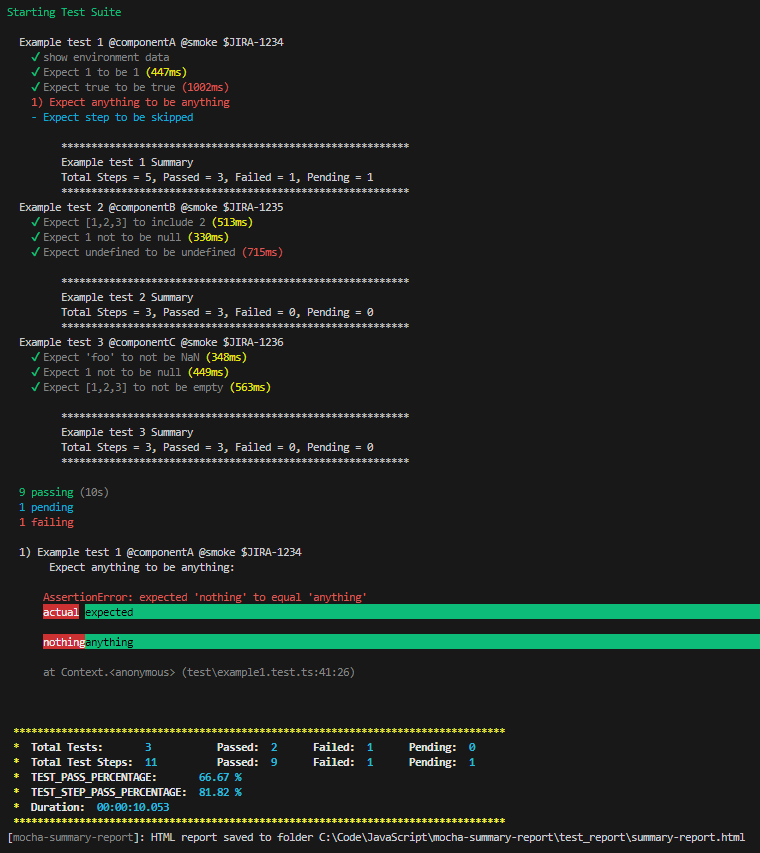

This report can be turned off via the report options.

## Text File Summary Feature
Provides a summary of all the suites in a text file. This text file can be added to an email.

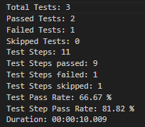

This report can be turned off via the report options.

## HTML Summary Feature
Provides a summary of when and where the suites were executed, a summary of all the suites and a summary of each test (including the test steps) in a HTML file.

The HTML report has a responsive web design to match most screen sizes.
### Large Screens
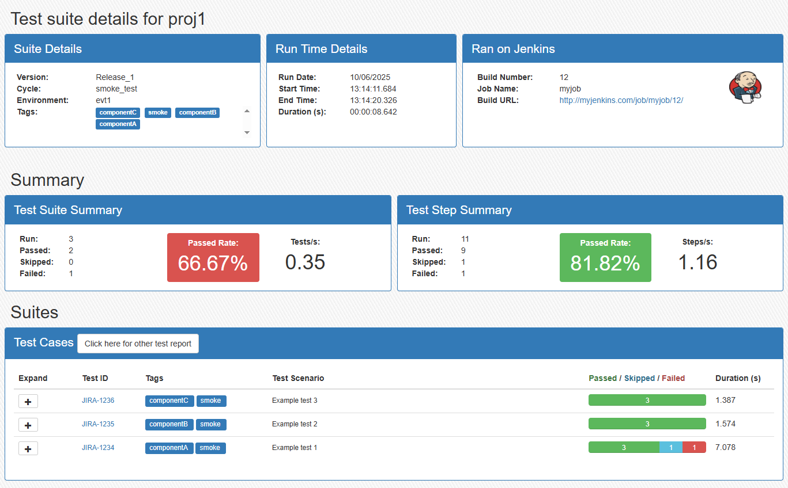


### Small Screens
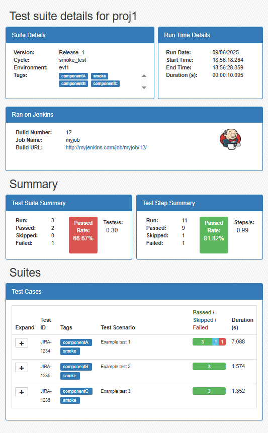


### Test Suite Details Section
This Section provides information about the overall details about when and where the tests were executed. 
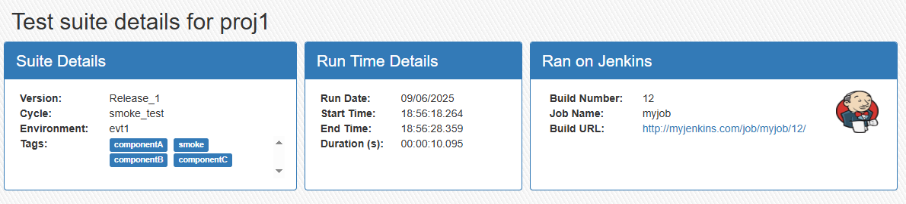

#### Suite Details
This sub section provides information about the:
- `Version` of the project release that is being tested. This information comes from process.env variable, this can be set in the CI server parameters or added to npm_config_ varaibles either in your npmrc file or as a custom option on the execution line. The location can be configured in the report options.
- Test `Cycle` that this test executed as part of. Similar to Version, this is configurable. 
- Test `Environment` that this test executed as part of. Similar to Version, this is configurable. 
- `Tags` found in all the tests that were executed. Duplicate tags are removed. The tag should be placed in your test file on the Mocha Describe feature. Tags can be useful to denote what type of test (e.g. smoke, regression etc) and/or the feature of the project. The tag prefix can be configured in the reporter options. 

#### Run Time Details
This sub section provides information about the:
- `Run Date` of the test execution.
- `Start Time` of the the first test execution.
- `End Time` of the last test execution.
- `Duration` of the total test executions.

#### CI Server Details
This section can show some limited information about the CI/CD server the test was executed on. A custom set of functions have been created based on `env-ci` package, this is due to that package uses `import` to load modules and I could not get it to work with the `mocha-multi-reporters` which uses `require` to load modules. This version of the package works with the following CI servers:
- Azure Devops
- Bitbucket
- CircleCI
- GitHub Actions
- GitLab CI
- Jenkins
- TeamCity
- Travis

If the tests are run on a local machine, then the sub section heading will indicate this.
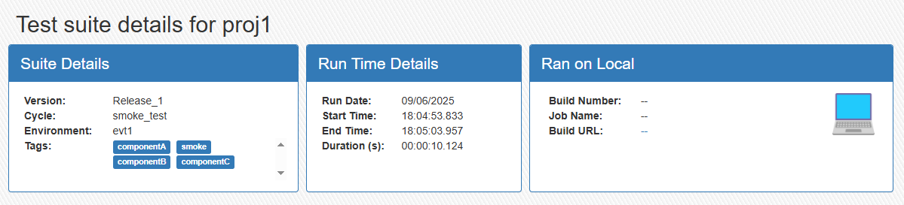


### Summary Section
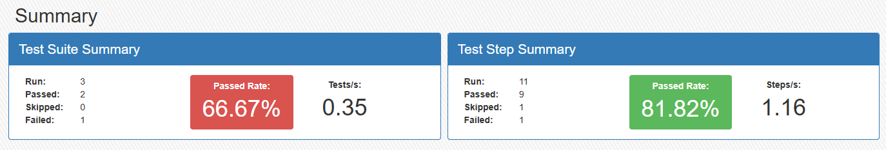

#### Test Suite Summary
This section provides an overall status of how many tests:
- `Run` in total
- `Passed`, a test that has all steps passed.
- `Skipped`, a test that was not executed.
- `Failed`, a test that has one or more failed step.

This section also provides metrics for:
- `Passed Rate` of tests executed, whch uses the formula `(passed tests / total executed tests) * 100`.
- `Tests/s` tests executed per second, which uses the formula `(passed tests + failed tests) / total execution time in seconds`. This metric can be used to comapre against manual test execution rates. 

#### Test Step Summary
This section provides an overall status of how many test steps:
- `Run` in total
- `Passed`, a test step that has a passed status.
- `Skipped`, a test step that was not executed.
- `Failed`, a test step that has a failed status.

This section also provides metrics for:
- `Passed Rate` of test steps executed, whch uses the formula `(passed test steps / total executed Test steps) * 100`.
- `Steps/s` steps executed per second, which uses the formula `(passed test steps + failed test steps) / total execution time in seconds`. This metric can be used to comapre against manual test execution rates. 


### Suites Section
#### Links to other reports
If you use other test reports like [Mochawesome](https://www.npmjs.com/package/mochawesome), you will need to use a reporter like [mocha-multi-reporters](https://www.npmjs.com/package/mocha-multi-reporters). This is how the Suites section is presented when no other reports are used during the Mocha test execution.

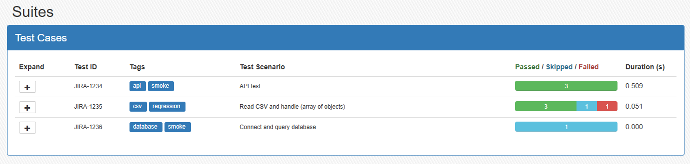


This is how the Suites section is presented when other reports are used during the Mocha test execution. A link button becomes available that opens the other report in a new browser tab.

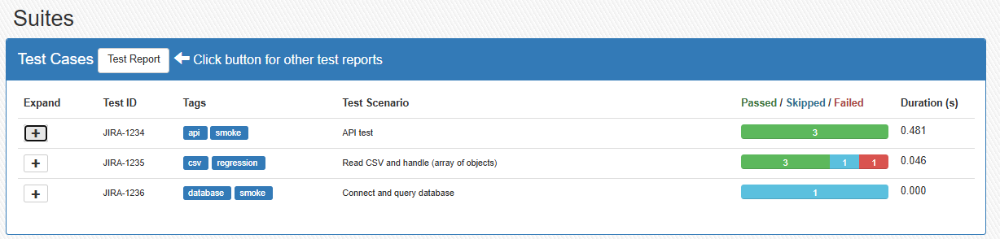

This report can be turned off via the report options.


#### Test Suite run information
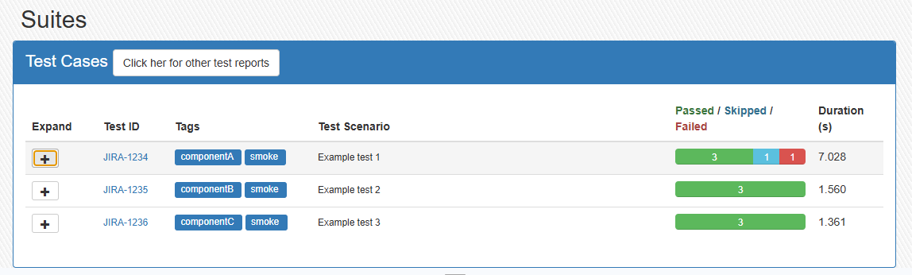

This section Provides detais of each test suite, including:
- The `Test ID`. This should be a unique code that can identify your test on your test management tool. In this example, Zephyr tests are located on Jira and will have a Jira issue key. The test ID should be placed on the Mocha Describe feature where tags are detailed. The Test ID prefix can be configured in the reporter options. Also, the Test ID can be a link to your manual test. The url is configured in the reporter options, this will be the url base that precedes the `Test ID`.
- `Tags` associated to the test. The tag should be placed in your test file on the Mocha Describe feature. Tags can be useful to denote what type of test (e.g. smoke, regression etc) and/or the feature of the project. The tag prefix can be configured in the reporter options. 
- `Test Scenario title`. The tags at test ID are stripped from the title.
- `Passed / Skipped / Failed` How many steps in the tests Passed, skipped or failed.
- The `Duration` of the test suite in seconds. 


#### Test Step information
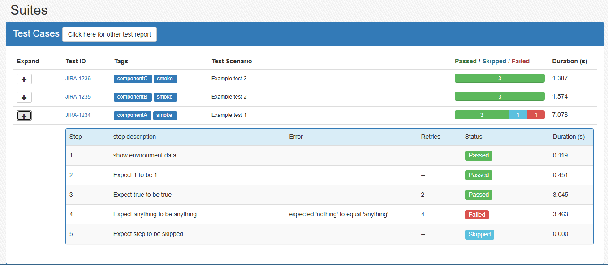

Each test suite can be expanded to reveal more details about the test steps status by clicking on the + icon in the Expand column. This new section shows the test step:
- `Step` Number.
- `Step description`. 
- `Error` message that was produced if the test step failed.
- `Retries` the number of retries performed, not the max number of retries (unless the max limit was reached).
- `Status`.
- `Duration` in seconds. This duration includes the duration of each retry.


## Install
Add mocha-summary-report to your project:
```
npm install mocha-summary-report
```

## Usage
Usage examples can be found on github [mocha-summary-report](https://github.com/CDTester/mocha-summary-report).


## Configuring reporters
### Using mocharc file
You can set up the reporter in a mocharc file and running the test with
```
mocha --config .mocharc.js
```
Where the mocharc file has the following options:
```javascript
    reporter: 'mocha-summary-report',
    'reporter-option': [
        'environmentVar=testenv',
        'projectName=project_name',
        'projectVersion=project_version',
        'projectCycle=npm_test_cycle',
        'manualTestLink=manual_test_url',
        'output=test_report',
        'testIDPrefix=$',
        'tagPrefix=@',
        'consoleSummary=true',
        'textFileSummary=true',
        'htmlSummary=true',
        'passRateGreen=80',
        'passRateAmber=70'
    ],
```

### Pointing the --reporter-option in mocharc file to a config file
This option can be used when using mocha-multi-reporters.
```
mocha --config .mocharc.js
```

Where the mocharc file has the following options:
```javascript
    reporter: 'mocha-summary-report',
    'reporter-option': ['configFile=./config/default.json'],
```

And the config file has the following options:
```json
{
    "reporterEnabled": "mocha-summary-report,mochawesome",
    "mochawesomeReporterOptions": {
        "reportDir": "test_report",
        "reportFilename": "test-report.html"
    },
    "mochaSummaryReportReporterOptions": {
        "environmentVar": "testenv",
        "projectName": "project_name",
        "projectVersion": "project_version",
        "projectCycle": "test_cycle",
        "manualTestLink": "manual_test_url",
        "output": "test_report",
        "testIDPrefix": "$",
        "tagPrefix": "@",
        "consoleSummary": "true",
        "textFileSummary": "true",
        "htmlSummary": "true",
        "passRateGreen": 80,
        "passRateAmber": 70,
        "otherReportLink": "test_report/test-report.html",
        "includeMochaBase": false
    }
}
```


## Reporter Options
The summary reports can be configured in the reporter options:

| Option Name | Type | Default | Description |
| :--- | :--- | :--- | :--- |
| `consoleSummary` | boolean | true | option to turn off the summary in the console log by setting to false. |
| `textFileSummary`| boolean | true | option to turn off the summary in a text file by setting to false. |
| `htmlSummary` | boolean | true | option to turn off the summary in a text file by setting to false. |
| `projectName` | string  | '--' | process.env variable name that denotes the name of the project. |
| `projectVersion` | string  | '--' | process.env variable name that denotes the version of the project being tested. |
| `projectCycle` | string  | '--' | process.env variable name that denotes the test cycle name of the test execution. |
| `environmentVar` | string  | '--' | process.env variable name that denotes the test environment. |
| `tagPrefix` | string  | '@'  | Prefix to be used to capture tags used in the tests. |
| `testIDPrefix` | string  | '$'  | Prefix to be used to capture the test ID used in the tests. |
| `passRateGreen` | string  | '90' | Value used to determine the background colour of the overall success rate of which is deemed acceptable. |
| `passRateAmber` | string  | '50' | Value used to determine the background colour of the overall success rate of which is deemed a warning. |
| `output` | string  | 'test_report' | Folder location to be used to save summary report to. |
| `otherReportLink` | string  | undefined  | File location of any other reports created at the end of the test execution. |
| `includeMochaBase` | true | option to turn off the Mocha Base reporter in the console. Mocha-multi-reporters includes Base reporting which duplicates this reporters output. |
| `manualTestLink` | string  | undefined | process.env variable name that contains the base URL of your test management application. The `testIDPrefix` value is suffixed to this URL to create the full link. |


The process.env variables can be set up in many ways:
- as a command line to running your tests e.g. `npm run test [spec] --project=ProjectName`. (these will be set up with a prefix of `npm_config_project`. The 'npm_config_project' is the value that needs to be saved in the reporter option for `projectName`. )
- in an .npmrc file (these will be set up with a prefix of `npm_config_`)
- from your CI application.


