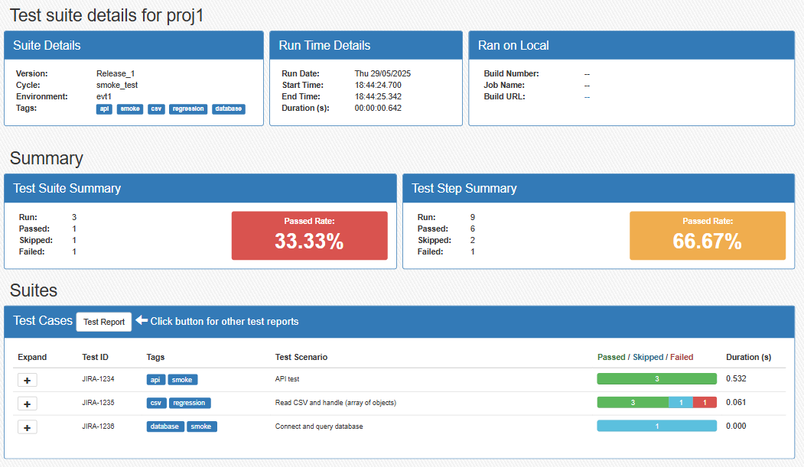

# mocha-summary-report
Generates summary reports of all the suites executed in a single Mocha execution.

## Features
### Console Summary
Provides a summary for each suite and a total summary of all the suites in the terminal console.

This report can be turned off via the report options.

### Text File Summary
Provides a summary of all the suites in a text file. This text file can be added to an email.

This report can be turned off via the report options.

### HTML Summary
Provides a summary of when and where the suites were executed, a summary of all the suites and a summary of each test (including the test steps) in a HTML file.

The HTML report has a responsive web design to match most screen sizes.
#### Large Screens

#### Small Screens

This report can be turned off via the report options.